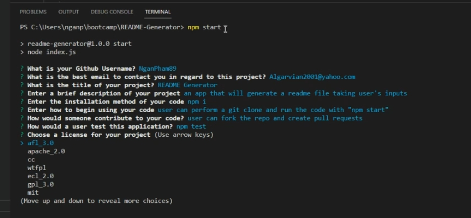

# README-Generator
A README file generator built with vanilla JS, Node, and Inquirer 

A sample README file can be found [here](./README-sample.md)

A video demo of the app can be found [here](https://drive.google.com/file/d/1erw3y0T-MemwNpdmZ0a1PK2bUlkOujpc/view)

## Screenshot

## Features of this app
- User can generate a complete README file after various inputs, such as their name, email, repo link
- Contents such as installation, testing, and usage would also be rendered
- A list of license is also provided to make selection easier

## Goals of this project
- [x] Learning various methods of Node.js, such as importing and exporting
- [x] Learning FS methods such as read, write, and append
- [x] Learning all the input options provided by inquirer
